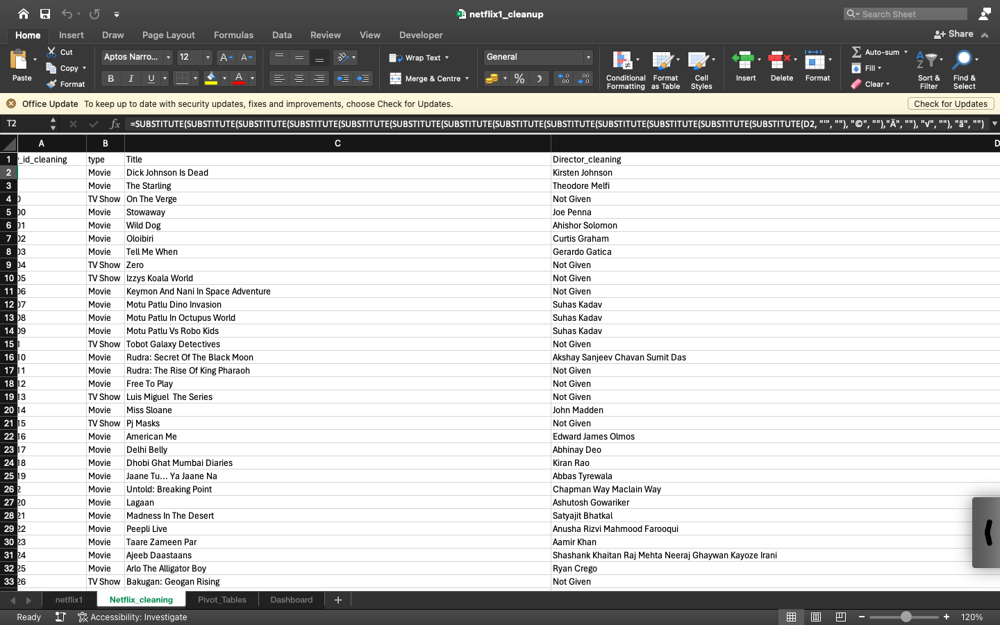
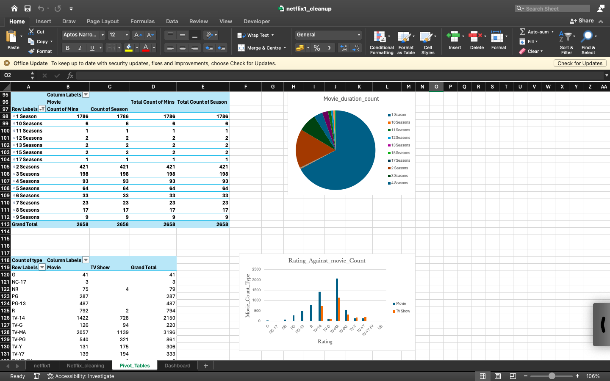
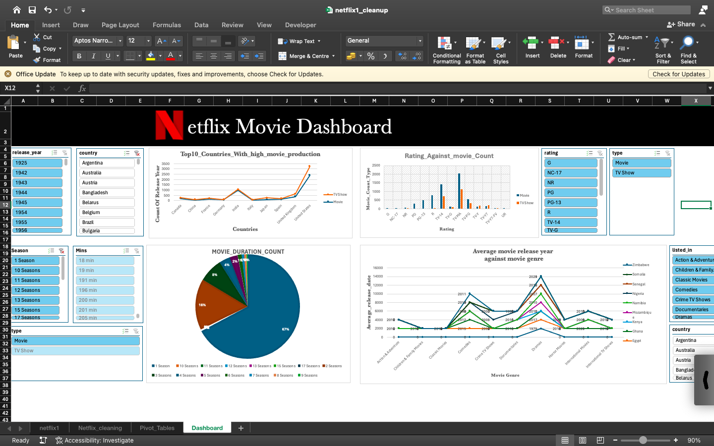

# NetflixExcelclean
A repository that follows the data cleaning, EDA, and Visualization using Microsoft Excel.
{: width="300" height="200"}

# Netflix DataSet

Netflix is a global streaming platform that offers on-demand movies, TV shows, and original content, revolutionizing the entertainment industry through personalized, subscription-based viewing.

## Features
- **Data Collection**: Utilizes public Netflix datasets from Kaggle which gathers historical data.
- **Data Preprocessing**: Includes data cleaning(using =Substitute methods, =if conditions, handling missing values.
- **Data Pivot**: Includes Aggregate data (sum, count, average, max). Group by categories (date, region, product). Compare data (e.g. sales by month vs. region). Filter & sort dynamically. Spot trends, patterns, and outliers
- **Visualization**: Creating an Interactive Dashboard.

## Installation
1. Clone the repository:
   ```bash
   git clone https://github.com/Brian342/NetflixExcelclean.git
   cd NetflixExcelclean
   ```

## Screenshots
Here are some visual representations of the project:

### Netflix Dataset 
{: width="300" height="200"}

### Pivot tables 
{: width="300" height="200"}

### Dashboard
{: width="300" height="200"}

## License
This project is licensed under the MIT License. See the LICENSE file for more details.
